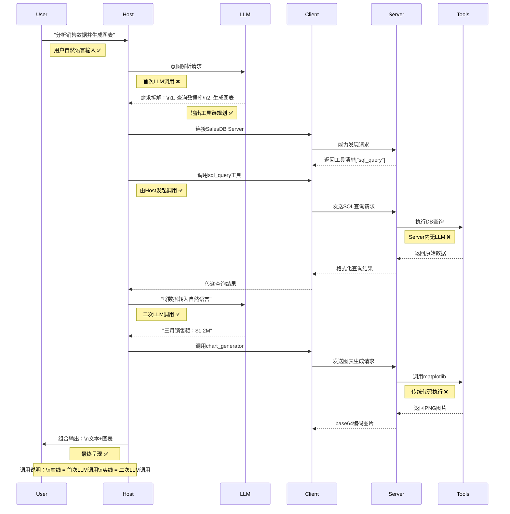

```mermaid
sequenceDiagram
    participant User
    participant Host
    participant LLM
    participant Client
    participant Server
    participant Tools

    User->>Host: "分析销售数据并生成图表" 
    Note right of User: 用户自然语言输入 ✅
    
    Host->>LLM: 意图解析请求
    Note right of Host: 首次LLM调用 ❌
    LLM-->>Host: 需求拆解：\n1. 查询数据库\n2. 生成图表
    Note left of LLM: 输出工具链规划 ✅
    
    Host->>Client: 连接SalesDB Server
    Client->>Server: 能力发现请求
    Server-->>Client: 返回工具清单["sql_query"]
    
    Host->>Client: 调用sql_query工具
    Note right of Host: 由Host发起调用 ✅
    Client->>Server: 发送SQL查询请求
    Server->>Tools: 执行DB查询
    Note right of Server: Server内无LLM ❌
    Tools-->>Server: 返回原始数据
    Server-->>Client: 格式化查询结果
    
    Client-->>Host: 传递查询结果
    Host->>LLM: "将数据转为自然语言"
    Note right of Host: 二次LLM调用 ✅
    LLM-->>Host: "三月销售额：$1.2M"
    
    Host->>Client: 调用chart_generator
    Client->>Server: 发送图表生成请求
    Server->>Tools: 调用matplotlib
    Note right of Server: 传统代码执行 ❌
    Tools-->>Server: 返回PNG图片
    Server-->>Client: base64编码图片
    
    Host->>User: 组合输出：\n文本+图表
    Note left of Host: 最终呈现 ✅
    
    %% 图例说明
    Note over User,Host: 调用说明：\n虚线 = 首次LLM调用\n实线 = 二次LLM调用
```